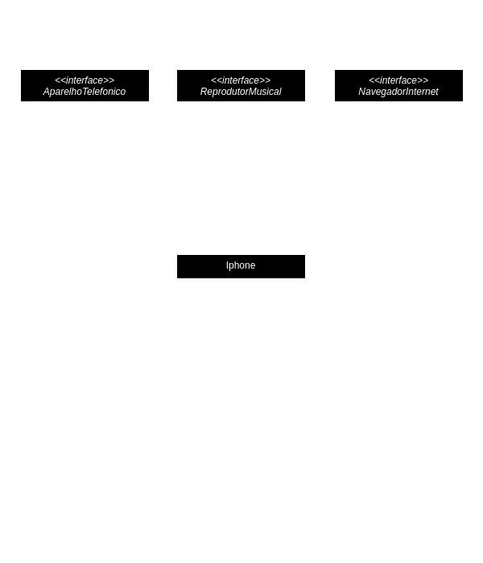

# 📱 Diagramação de classes do Primeiro iPhone

## 📋 Descrição
Neste repositório, você encontrará uma implementação abrangente de um desafio de modelagem de software que tem como objetivo representar de forma detalhada e precisa as funcionalidades de um iPhone. Este projeto utiliza princípios de programação orientada a objetos e técnicas de modelagem UML para criar uma estrutura robusta e versátil que permite que um dispositivo iPhone desempenhe os três papéis distintos e cruciais: Reprodutor Musical, Aparelho Telefônico e Navegador na Internet.

Este repositório não apenas fornece o código-fonte em Java para as classes e interfaces correspondentes, mas também inclui uma documentação completa, insights de design e instruções detalhadas sobre como executar o código e explorar o diagrama UML associado. Ao explorar este projeto, eu tive a oportunidade de aprender e aplicar melhores práticas de engenharia de software, desenvolvendo um entendimento profundo de como a modelagem e a programação orientada a objetos podem ser utilizadas para criar sistemas complexos e funcionais.

## 📊 Diagrama UML

  

